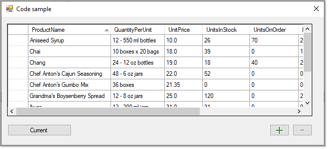

# About



Code sample which reads data from json file into a 
strong typed model which implements `INotifyPropertyChanged`. 
Once data is loaded into a `SortableBindingList<Products>` operations such as edit, delete and add are simple.

- The <kbd>+</kbd> and <kbd>-</kbd> buttons are used to increment and decrement `UnitsInStock` property of the current row in the DataGridView
- On close event of the form saves the data back to the original file. 

## Forms

- Form1 uses a model
- Form2 uses a DataTable

# Notes

- The operations here will work with a database table
- If the data source was a DataTable we would use code like in **figure 1**

## Figure 1


Increase

```csharp
var row = ((DataRowView)bindingSource.Current).Row;
row.SetField("UnitsInStock", row.Field<int>("UnitsInStock") +1);
```

Decrease

```csharp
var row = ((DataRowView)bindingSource.Current).Row;
row.SetField("UnitsInStock", row.Field<int>("UnitsInStock") -1);
```
