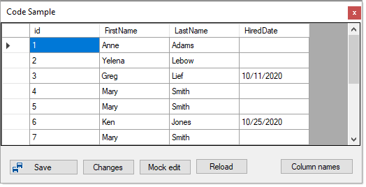

# About

Originally written to answer a forum question, now refactoring for another forum question.

All data operations are in EmployeeOperations.

## Note

- **New rows** the data shown in the DataGridView does not show the primary key, it's there but needs to be brought out with reflection.
- **Limited exception handling** only in EmployeeOperations, no assertion or try/catch in the form.
- `08/04/2022` added reloading data from the database

## Screenshot

Will be only one button for save when finished.

