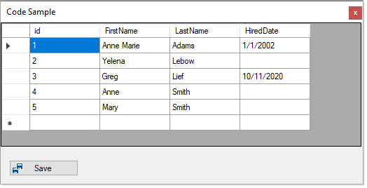

# About

Originally written to answer a forum question, now refactoring for another forum question.

## TODO

- Finish moving code from form to EmployeeOperations
- Test code
- Remove all code from form that resides in EmployeeOperations

## Screenshot

Will be only one button for save when finished.

