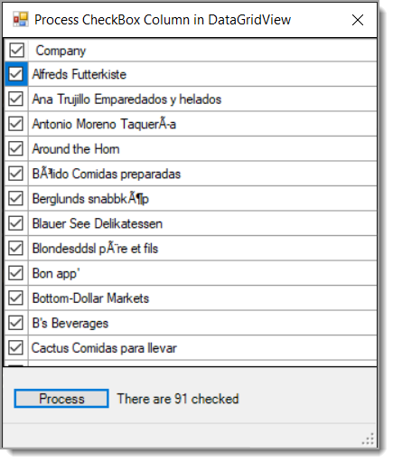

# About

Code sample to provide a check/uncheck rows.

Taken from this Code [Project article](https://www.codeproject.com/Articles/42437/Toggling-the-States-of-all-CheckBoxes-Inside-a-Dat) many years ago then converted to VB.NET then back to C#.

Reads data from a SQL-Server database. The script to work with the database is in the DatabaseScripts folder.

