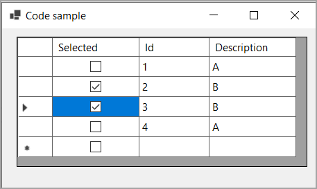

# About

Simple example for getting at a bool property in a DataGridView on click.

Many coders go with a unbound DataGridView as it appears simple and quick while the optimal solution requires a tad more effort but once seen its simple.

By default with just a BindingList sorting is not possible so SortableBindingList is used which is in the class project BindingListLibrary.

