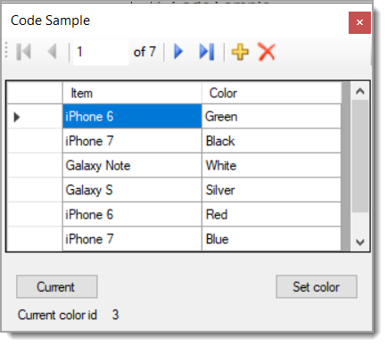

# About

Code sample for using DataGridViewComboBox

Main data is a product table with a relationship to a table for colors.

Two [BindingSource](https://docs.microsoft.com/en-us/dotnet/api/system.windows.forms.bindingsource?view=netframework-4.8) components are used which in this case provides access to the current row in the DataGridView. Explore working with using BindingSource which are very helpful.

## Before running

:heavy_check_mark: Run databasescript.sql

