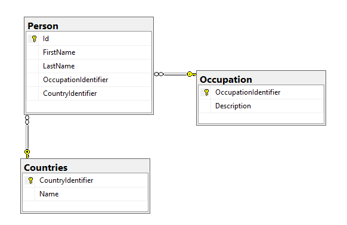
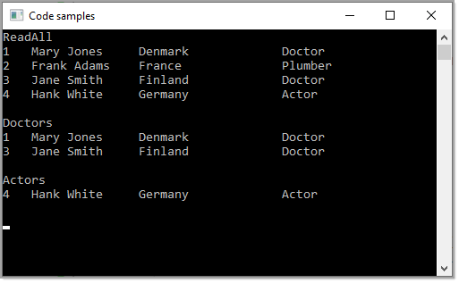

# About

Sample for `QA` forum question using EF Core 5, C# 9.





**Sample read**

```csharp
private static void Doctors()
{
    Console.WriteLine(nameof(Doctors));

    using var context = new Context();

    int occupationIdentifier = 1;

    var doctors = context.Person
        .Include(p => p.OccupationIdentifierNavigation)
        .Include(p => p.CountryIdentifierNavigation)
        .Where(p => p.OccupationIdentifier == occupationIdentifier)
        .ToList();

    foreach (var person in doctors)
    {
        Console.WriteLine($"{person.Id,-4}{person.FullName,-15}{person.CountryIdentifierNavigation.Name,-20}{person.OccupationIdentifierNavigation.Description}");
    }

    Console.WriteLine();
}
```