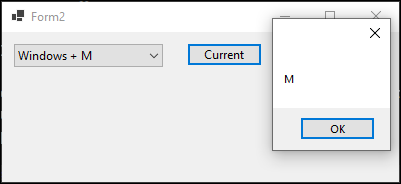

# About

Code sample to get descriptions for `enum` members.



```csharp
public class Operations
{
    /// <summary>
    /// Generic method to get descriptions for enum members
    /// </summary>
    /// <typeparam name="T"></typeparam>
    /// <returns></returns>
    public static List<ItemContainer> GetItems<T>() =>
        Enum.GetValues(typeof(T)).Cast<T>()
            .Cast<Enum>()
            .Select(value => new ItemContainer
            {
                Description = ((DescriptionAttribute)Attribute.GetCustomAttribute(value.GetType().GetField(value.ToString()),
                    typeof(DescriptionAttribute))).Description,
                Value = value
            }).ToList();
}
```
---

Code to get enum member and description. Note that both extensions return the exact same information. 
The first is hard code while the second is generic, when possible always go with generic.

```csharp
public static class Extensions
{
    
    public static (string text, Categories category) CurrentCategory(this ListControl source)
        => (source.Text, (Categories)source.SelectedValue);


    public static (string text, T category) Current<T>(this ListControl source)
        => (source.Text, (T)source.SelectedValue);

}
```

Example for the generic method

```csharp
var (text, category) = CategoriesComboBox.Current<Categories>();
```

# Data binding tip

When setting the property, use nameof expression rather than a string as if the property name changes when a string and the developer does not update the code this causes a runtime exception while using nameof with a proper refactor the property name is updated with the refactor.

```csharp
label1.DataBindings.Add("Text", _bindingSource, nameof(ItemContainer.Description));
```
