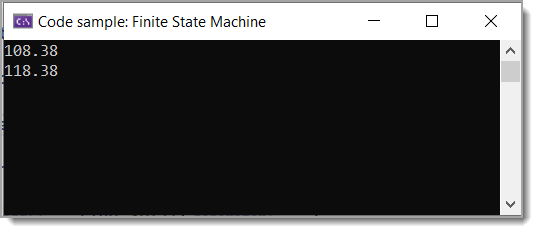

# About

Simple Finite State Machine example




```csharp
internal partial class Program
{
    static void Main(string[] args)
    {
        List<double> list = new();
        
        string[] exceptions = { "Sig1", "Sig2" };

        foreach (var line in Helpers.StateReader(@"TextFile2.txt"))
        {
            if (exceptions.Contains(line)) continue;

            var parts = line.Split(' ');
            if (parts.Length < 10)
            {
                continue;
            }

            if (double.TryParse(parts[9], out var value))
            {
                list.Add(value);
            }
            else
            {
                // failed to convert
            }
        }

        foreach (var item in list)
        {
            Console.WriteLine(item);
        }

        Console.ReadLine();
    }
}
```

--- 

```csharp
public class Helpers
{
    public static IEnumerable<string> StateReader(string fileName)
    {
        bool isMarker = false;
        var lines = File.ReadLines(fileName).ToList();
        foreach (string line in lines)
        {
            isMarker = true;
            if (line.StartsWith("============>"))
            {
                isMarker = !isMarker;
            }
            else if (isMarker)
            {
                yield return line;
            }
        }
    }
}
```