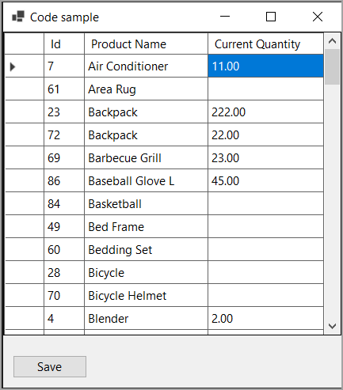

# About

Simple example which reads data from a SQL-Server database table into a DataGridView via EF Core and permits changes to be saved back to the database.

- Products uses INotifyPropertyChanged for change tracking to work
- SortableBindingList provides sorting of DataGridView columns

