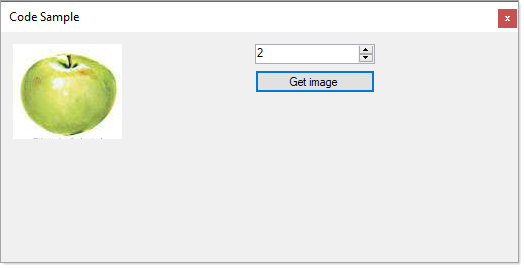
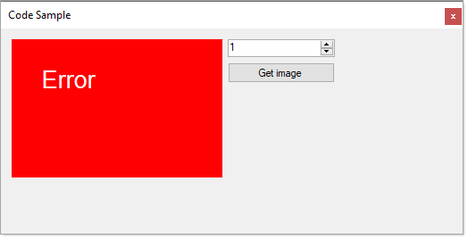


Simple example to read an image from SQL-Server to a PictureBox



Invalid image



```csharp
private void OnShown(object sender, EventArgs e)
{
    numericUpDown1.Minimum = 1;
    numericUpDown1.Maximum = DataOperations.RowCount();

    /*
    * There is no key pasted 3, so 4 is invalid
    */
    var fruit = DataOperations.GetImage(4);

    if (fruit.Picture == null)
    {
        pictureBox1.Image = DataOperations.ConvertTextToImage(Environment.NewLine + "    Error", "Arial", 20, Color.Red, Color.White, 300, 200);
    }
        
}
```