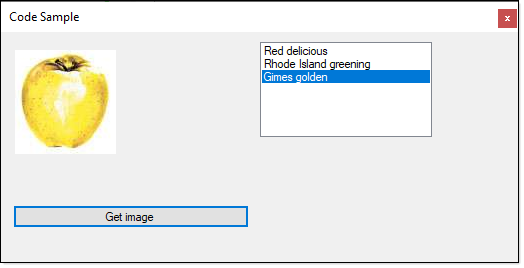
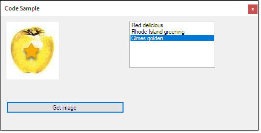
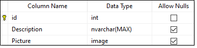


Simple example to read an image from SQL-Server to a PictureBox

If there is an invalid id sent a error image is set to the Picturebox

**08/16/2022**

Added Form2 which shows how to update an image, in this case from a file.

1. Run Scripts\Original.sql
2. Run the app, look at the last image, a yellow apple
3. Open Program.cs, change startup form to Form2
4. Run, press the button
5. Open Program.cs, change startup form to Form1
6. Run, note the third image has changed from what we did in Form2.

Form1 before changes in Form2

Form1 after changes in Form2

Table columns

# Important

From Microsoft on ntext, text, and image (Transact-SQL)

The ntext, text, and image data types will be **removed in a future** version of SQL Server. Avoid using these data types in new development work, and plan to modify applications that currently use them. Use nvarchar(max), varchar(max), and varbinary(max) instead.

[Microsoft page](https://docs.microsoft.com/en-us/sql/t-sql/data-types/ntext-text-and-image-transact-sql?view=sql-server-ver16)

