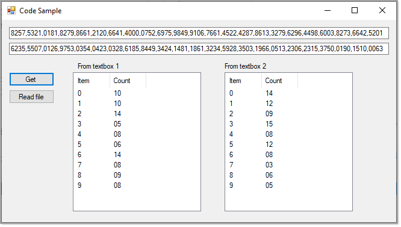

# About

Code to obtain count of each character in a string. In this case showing numerics.




```csharp
public static List<Item> GetAllItems(string values)
{
    var itemsGroup = (
            from chr in values.ToCharArray()
            group chr by chr into grp
            select new Item
            {
                Character = grp.Key,
                Occurrences = grp.Count(),
                Code = Convert.ToInt32((int)grp.Key)
            })
        .ToList()
        .OrderBy(item => item.Character.ToString());

    return (from item in itemsGroup select item).ToList();

}
```