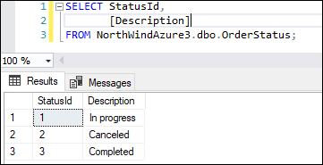
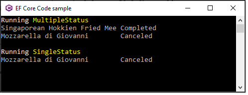
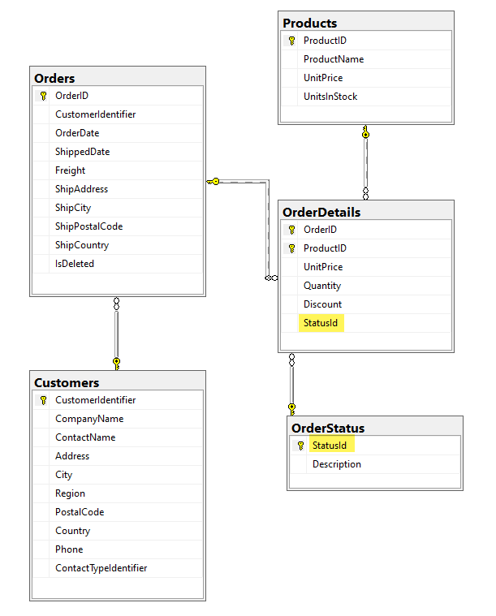

# About

An example for properly setting up order status of each item in an order.

Key is not storing status of each record in OrderDetails as a string, instead in this example OrderStatus table is used.



Once the tables have been created and populated test with a query in SSMS.

```sql
SELECT OD.OrderID, 
       OD.ProductID, 
       OD.UnitPrice, 
       OD.Quantity, 
       OD.Discount, 
       OD.StatusId, 
       P.ProductName, 
       OS.Description
FROM OrderDetails AS OD
     INNER JOIN OrderStatus AS OS ON OD.StatusId = OS.StatusId
     INNER JOIN Products AS P ON OD.ProductID = P.ProductID 
WHERE OD.OrderID = 10248 AND OD.StatusId IN (2,3)
```

Next write EF Core code

```csharp
using System.Collections.Generic;
using System.Linq;
using Microsoft.EntityFrameworkCore;
using OrderDetailsStatusConsoleApp.Data;
using OrderDetailsStatusConsoleApp.Models;

namespace OrderDetailsStatusConsoleApp.Classes
{
    public class DataOperations
    {
        /// <summary>
        /// Get order detail status for products in an order
        /// </summary>
        /// <param name="orderId">order id</param>
        /// <param name="identifiers">statues</param>
        /// <returns></returns>
        public static List<OrderDetails> OrdersDetailsList(int orderId, int[] identifiers)
        {
            using var context = new NorthContext();
            return context
                .OrderDetails
                .Include(x => x.Product)
                .Include(x => x.Status)
                .Where(x => x.OrderId == orderId && identifiers.Contains(x.Status.StatusId))
                .ToList();
        }
    }
}
```

Code to execute

```csharp
partial class Program
{
    static void Main(string[] args)
    {
        using var context = new NorthContext();
        int identifier = 10248;
        int[] identifiers = { 2, 3 };

        List<OrderDetails> orderDetailsList = DataOperations
            .OrdersDetailsList(identifier, identifiers);

        if (orderDetailsList.Count >0)
        {
            foreach (var item in orderDetailsList)
            {
                Console.WriteLine($"{item.Product.ProductName,-30}{item.Status.Description}");
            }
        }
        else
        {
            Console.WriteLine("No matches");
        }

        Console.ReadLine();
    }
}
```



## Schema

