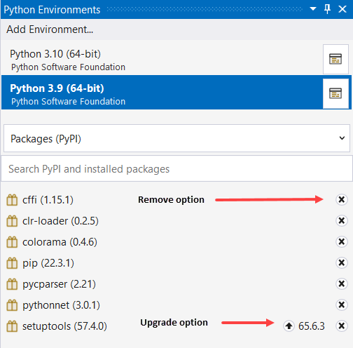
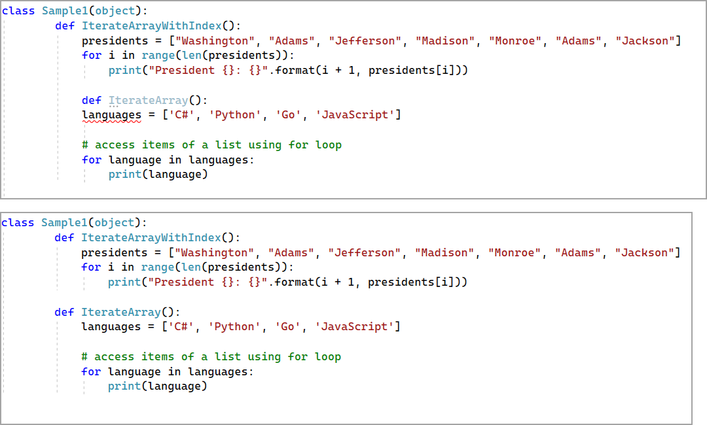
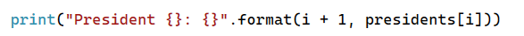
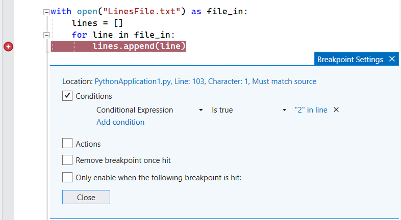

# Helpful links

- [W3 Python help](https://www.w3schools.com/python/default.asp)
- [Install packages in your Python environment](https://learn.microsoft.com/en-us/visualstudio/python/tutorial-working-with-python-in-visual-studio-step-05-installing-packages?view=vs-2022)
- [Write and run code](https://learn.microsoft.com/en-us/visualstudio/python/tutorial-working-with-python-in-visual-studio-step-02-writing-code?view=vs-2022)
- [colorama](https://pypi.org/project/colorama/) Makes ANSI escape character sequences (for producing colored terminal text and cursor positioning) work under MS Windows.

# VS Code

Microsoft Visual Studio is the best way to code Python but sometimes VS Code may be an option but note VS Code is light weight.

:sparkle: Tip: setup a shortcut

1. Go to Preferences (the gear icon on the bottom left) → Keyboard Shortcuts
1. Type 'run Python file in terminal'  suggest <kbd>Ctrl</kbd> + <kbd>Alt</kbd> + <kbd>N</kbd>.

# Code presented

- Karen Payne until yesterday never used `Python` but once you have written code in at least three or four languages the huttle is syntax of the language.
- All code works

# Importing external modules

- Solution Explorer, select the project
- Select Python Environments
- Select the version of Python
- Right click `Manage Python Packages`
- Type in the package name, choose run as admin, enter user name and password (note you may need the service desk assistance)




# Code indentation

> **Note**
> The following is important to writing good code. I have seen complex code with one letter variable that make it exteremly difficult to figure out problems in code.

Python is touchy about indentation levels, in the first image the variable `languages` red squigly's because of improper indentation while in the second image we have proper indentation. This means the first code block will cause a run time exception while the second runs as expected.



# Place holders

In the above on indenation note `{}: {}`, these are place holders for `format(i + 1, presidents[i])`



# Variable names

Most code samples when performing things like iterating an array use single character letters e.g. <kbd>i</kbd>

```python
def IterateArrayWithIndex():
    presidents = ["Washington", "Adams", "Jefferson", "Madison", "Monroe", "Adams", "Jackson"]
    for i in range(len(presidents)):
        print("President {}: {}".format(i + 1, presidents[i]))
```

It is recommended to give meaningful names to variables and when in doubt use <kbd>index</kbd>

```python
def IterateArrayWithIndex():
    presidents = ["Washington", "Adams", "Jefferson", "Madison", "Monroe", "Adams", "Jackson"]
    for index in range(len(presidents)):
        print("President {}: {}".format(index + 1, presidents[index]))
```

:heavy_check_mark: Its always a good idea to take time to make code readable

```python
class Sample1(object):
        
        def IterateArrayWithIndex():

            presidentsLastNames = [
                "Washington", 
                "Adams", 
                "Jefferson", 
                "Madison", 
                "Monroe", 
                "Adams", 
                "Jackson"
             ]

            for index in range(len(presidentsLastNames)):
                print("President {}: {}".format(
                    index + 1, 
                    presidentsLastNames[index]))


        def IterateArray():
            languages = [
                'C#', 
                'Python', 
                'Go', 
                'JavaScript'
            ]

            # access items of a list using for loop
            for language in languages:
                print(language)
# End of class
```

# Simple debugging

We want to peek at the lines read from a file being added to an array.

Single click in the gutter and a red dot appears, run the program and the debugger will stop on the line with the red dot. Having the `Local` window open allows you to inspect information.


## Breakpoint conditions

You can control when and where a breakpoint executes by setting conditions. The condition can be any valid expression that the debugger recognizes.

[Microsoft docs](https://learn.microsoft.com/en-us/visualstudio/debugger/using-breakpoints?view=vs-2022#breakpoint-conditions)




## Troubleshoot Breakpoints in the Visual Studio Debugger

At one point or another breakpoints may not work as expected and is usually from a misunderstanding of the developer, not a debugger issue, see [the following](https://learn.microsoft.com/en-us/visualstudio/debugger/troubleshooting-breakpoints?view=vs-2022) to learn more.

## Tips and Tricks for the Debugger

Read [this topic](https://learn.microsoft.com/en-us/visualstudio/debugger/debugger-tips-and-tricks?view=vs-2022) to learn a few productivity tips and tricks for the Visual Studio debugger. For a look at the basic features of the debugger

# When stuck

1. Read the [docs](https://docs.python.org/3/)
1. Talk to team mates
1. Use Stackoverflow e.g. [Does Python have a string 'contains' substring method?](https://stackoverflow.com/questions/3437059/does-python-have-a-string-contains-substring-method)
1. Ask Karen