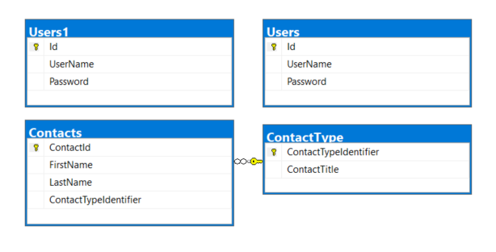

# Instructions to setup database

1. Run `script.sql` to create database which creates tables User and User1 without populating followed by creating and populating Contacts and ContactType tables.
1. Run `PasswordCheckFunction.sql` which creates a function to validate password in table Users1
1. Run `InsertStatements.sql` which inserts records into tables User and User1

