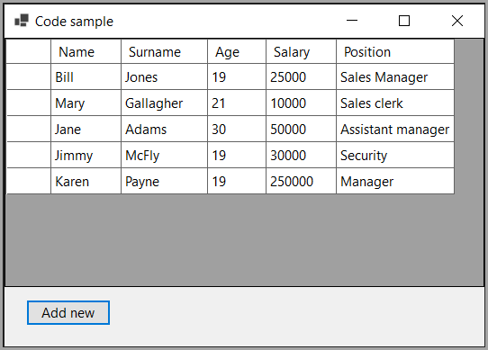

# Stackoverflow question

A [question](https://stackoverflow.com/questions/77688777/cant-add-data-from-json-to-the-datagridview) was asked how to present data from a json file in a DataGridView with the ability to add a new item in another form and save back to the json file.

They seem to be using .NET Framework and I use .NET Core so did not reply.

## Important

Personally, would never do this as what happens if the person who asked for this later decides to have multiple users use the application, for this reason the better idea is to use a database along with many other reasons and benefits for using a database.

Edits in the DataGridView are possible via [change notification](https://learn.microsoft.com/en-us/dotnet/api/system.componentmodel.inotifypropertychanged?view=net-8.0). ReSharper sets all properties with a single mouse click.

Deletes are not handled as we need several events to do this and did not want to cloud up things.

The Position property should be a DataGridViewComboBoxColumn. For those interested, I have an article on how to use a DataGridView ComboBox [here](https://dev.to/karenpayneoregon/learn-to-use-a-databound-datagridview-combobox-in-windows-forms-1coa).

The Add Form has no controls, does a mock add, see comments in the form.

## Notes

- Demonstrates
    - Using an event to pass data from child form to parent form and add to an existing BindingList followed by saving back to the original file. The add to exist file could be done in a separate method.
    - Using property change notification
    - Working with a BindingSource and special BindingList
- The code is for a single user else the method for incrementing the primary key is unwise. This in itself prompts to use a database and if json is needed it is easy to read from a database table and export to json or comma delimited file.

