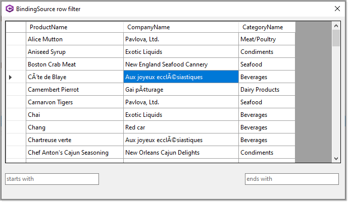

# About

Uses extension methods to perform BindingSource filtering on a DataTable. Two methods are demonstrated, starts with and ends with case insensitive. 

Type in a search in either one for filtering, empty the current TextBox to remove the filter. For a real application there would be one TextBox with a ComboBox for options, starts with ends with and contains rather than two TextBox controls. 

Data is load from a database table but do not be concerned with this if not using a database as at the point the DataTable is used in the form the DataTable has no knowledge of the database.

See also TechNet [BindingSource Filter with Starts, contains, ends with and case sensitive options](https://social.technet.microsoft.com/wiki/contents/articles/53413.bindingsource-filter-with-starts-contains-ends-with-and-case-sensitive-options.aspx)

