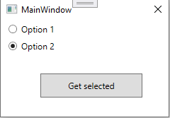

# About

Tinkering with setting up a class for user settings for radio buttons, nothing fancy, comes from a question in a developer forum.



```csharp
public class MyUserSettings : ApplicationSettingsBase
{

    [UserScopedSetting()]
    [DefaultSettingValue("")]
    public string SelectedRadioButton
    {
        get => this[nameof(SelectedRadioButton)] as string;
        set => this[nameof(SelectedRadioButton)] = value;
    }

}
```