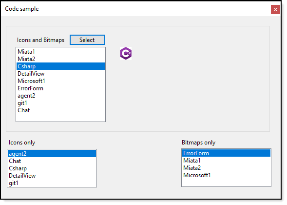

# About

Provides code to read/display images from a Windows From project resource, in this case to a PictureBox.

- Method to get all icon and bitmaps into a single list.
- Extension methods to separate icon and bitmaps from above list.
- Uses a singleton class to work with images.

# Requires

Microsoft Visual Studio 2019 or higher (code should work with Visual Studio 2017 by changing the target framework from .NET 5 to .NET 4x)

# Microsoft Technet 

https://social.technet.microsoft.com/wiki/contents/articles/54259.windows-forms-access-resources-by-name.aspx

